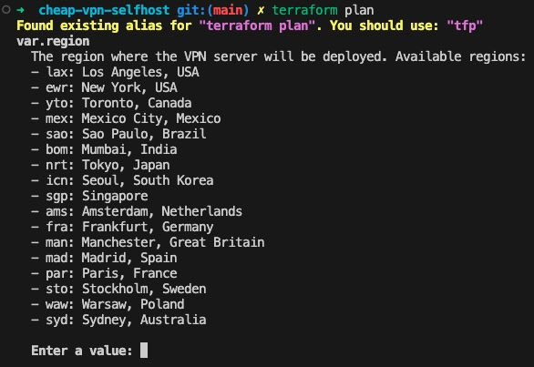
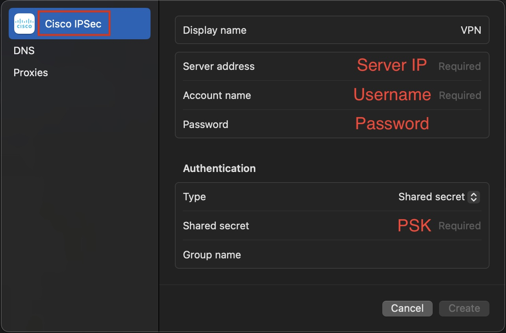

# Cheap VPN Self Hosted

[](https://opensource.org/licenses/MIT)
[](https://www.terraform.io/downloads.html)
[](https://www.vultr.com/)
[](http://makeapullrequest.com)
[](https://github.com/flyingdog1310/cheap-vpn-selfhost/graphs/commit-activity)
[](https://github.com/flyingdog1310/cheap-vpn-selfhost)
[](https://github.com/flyingdog1310/cheap-vpn-selfhost)

[中文 README](./README_zh.md)

A simple, secure, and cost-effective self-hosted VPN solution using Vultr's infrastructure. This project allows you to quickly deploy your own VPN server with minimal configuration.

## Features

- 🚀 **Quick Deployment**: Deploy a VPN server in minutes using Terraform
- 💰 **Cost-Effective**: $0.007/hour for reliable VPN service. Pay only for the time you use.
- 🔒 **Secure**: Uses IPsec/L2TP protocol for encrypted connections
- 🌍 **Global Coverage**: Multiple regions across Americas, Asia, Europe, and Oceania
- 🛠️ **Automated Setup**: Zero manual configuration required
- 📱 **Cross-Platform**: Works with all major operating systems and devices

## Supported Regions

### Americas
- 🇺🇸 Los Angeles, USA (lax)
- 🇺🇸 New York, USA (ewr)
- 🇨🇦 Toronto, Canada (yto)
- 🇲🇽 Mexico City, Mexico (mex)
- 🇧🇷 Sao Paulo, Brazil (sao)

### Asia
- 🇯🇵 Tokyo, Japan (nrt)
- 🇰🇷 Seoul, South Korea (icn)
- 🇸🇬 Singapore (sgp)
- 🇮🇳 Mumbai, India (bom)

### Europe
- 🇳🇱 Amsterdam, Netherlands (ams)
- 🇩🇪 Frankfurt, Germany (fra)
- 🇬🇧 Manchester, Great Britain (man)
- 🇪🇸 Madrid, Spain (mad)
- 🇫🇷 Paris, France (par)
- 🇸🇪 Stockholm, Sweden (sto)
- 🇵🇱 Warsaw, Poland (waw)

### Oceania
- 🇦🇺 Sydney, Australia (syd)

## Prerequisites

1. Install [Terraform](https://www.terraform.io/downloads.html) (v1.0.0 or newer)
2. Register for a [Vultr account](https://www.vultr.com/) to get an API Key
3. Basic command-line operation knowledge
4. A credit card for Vultr account verification (required for API access)

## Technical Stack

- **Infrastructure**: Automated deployment using Terraform
- **Server**: Vultr cloud service with Ubuntu 22.04
- **VPN**: IPsec/L2TP protocol
- **Cost**: Approximately $5.00 per month, $0.007 per hour

## Quick Start

1. **Clone the Project**
   ```bash
   git clone https://github.com/your-username/cheap-vpn-self-host.git
   cd cheap-vpn-self-host
   ```

2. **Set Vultr API Key**
   ```bash
   export VULTR_API_KEY="your_vultr_api_key"
   ```
   You can get the API key from the [Vultr Control Panel](https://my.vultr.com/settings/#settingsapi)
   

3. **Initialize Terraform**
   ```bash
   terraform init
   ```

4. **Deploy VPN Server**
   ```bash
   terraform apply
   ```
   When prompted, enter the region code (e.g., `nrt` for Tokyo) where you want to deploy the VPN server.
   

   After execution, Terraform will automatically:
   - Create a Vultr server
   - Set up VPN service on the server
   - Generate random VPN credentials and output them locally

5. **Wait for Deployment**
   - After deployment, Terraform will output the following information:
     - Server IP address
     - VPN PSK
     - VPN username
     - VPN password
   - After local deployment is complete, it will take about 5 minutes for the cloud server to fully ready, please be patient

6. **Connect to VPN**
   - Use the built-in VPN client
   - Select L2TP/IPsec protocol
   - Enter the connection information from Terraform output
   

7. **Enjoy your personal VPN server**

## Clean Up Resources

To delete all servers when you're done, run:
```bash
terraform destroy
```

## Troubleshooting

### Common Issues

1. **Connection Timeout**
   - Verify the server IP address is correct
   - Check if the server is running in Vultr dashboard
   - Ensure your firewall allows L2TP/IPsec traffic

2. **Authentication Failed**
   - Double-check VPN credentials from Terraform output
   - Ensure PSK is entered correctly
   - Try regenerating credentials by redeploying

3. **Slow Connection**
   - Try connecting to a different region
   - Check your local internet connection
   - Monitor server resources in Vultr dashboard

### Getting Help

If you encounter any issues:
1. Check the [Issues](https://github.com/your-username/cheap-vpn-self-host/issues) section
2. Create a new issue with detailed information about your problem
3. Include relevant logs and error messages

## Security Best Practices

- 🔑 Change VPN password regularly
- 🔒 Keep VPN credentials secure
- 📊 Monitor server usage and costs
- 🛡️ Use strong passwords
- 🔄 Update server regularly

## Contributing

Contributions are welcome! Please feel free to submit a Pull Request. For major changes, please open an issue first to discuss what you would like to change.

1. Fork the repository
2. Create your feature branch (`git checkout -b feature/AmazingFeature`)
3. Commit your changes (`git commit -m 'Add some AmazingFeature'`)
4. Push to the branch (`git push origin feature/AmazingFeature`)
5. Open a Pull Request

## License

This project is licensed under the MIT License - see the [LICENSE](LICENSE) file for details.

## Acknowledgments

- [Vultr](https://www.vultr.com/) for providing the infrastructure
- [Terraform](https://www.terraform.io/) for infrastructure as code
- [hwdsl2](https://github.com/hwdsl2/setup-ipsec-vpn) for VPN setup script
