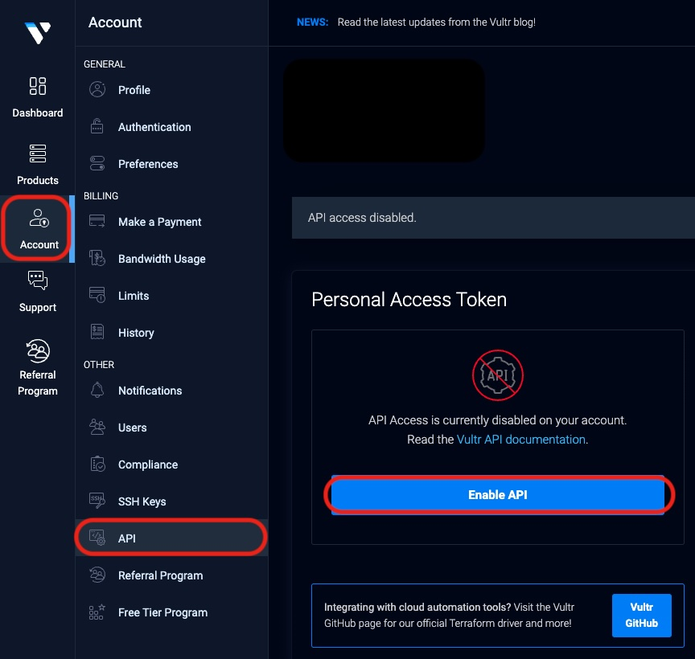
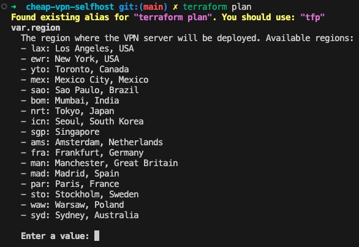
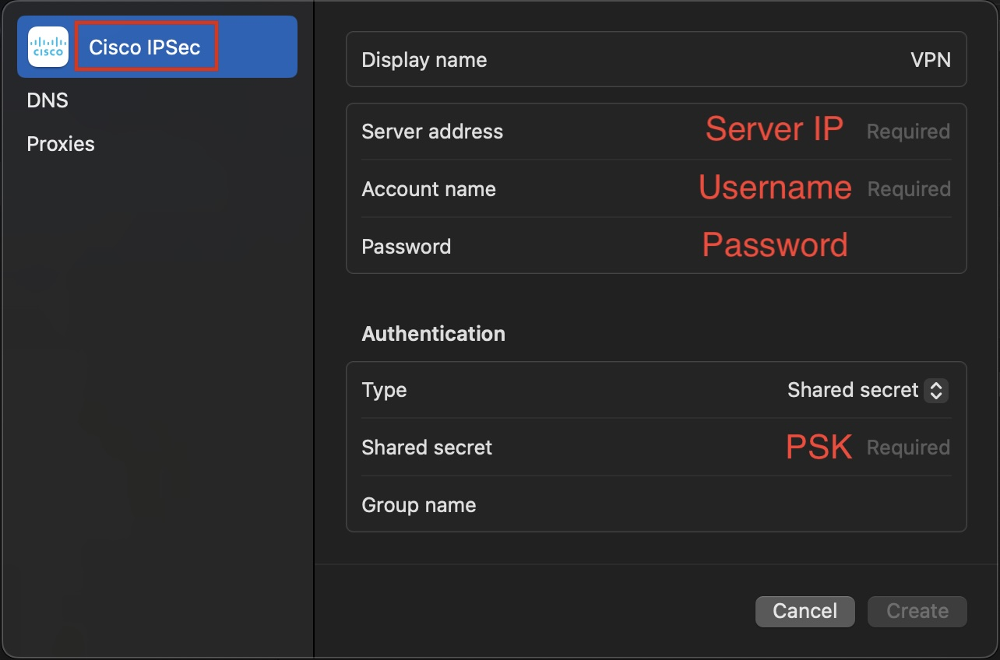

# 自建低成本 VPN 伺服器
[](https://opensource.org/licenses/MIT)
[](https://www.terraform.io/downloads.html)
[](https://www.vultr.com/)
[](http://makeapullrequest.com)
[](https://github.com/flyingdog1310/cheap-vpn-selfhost/graphs/commit-activity)
[](https://github.com/flyingdog1310/cheap-vpn-selfhost)
[](https://github.com/flyingdog1310/cheap-vpn-selfhost)

[English README](./README.md)

這是一個簡單、安全且經濟實惠的自建 VPN 伺服器專案。使用 Vultr 作為雲端服務提供商，可以快速設定一個自用的安全 VPN 伺服器，無需複雜配置。

## 特點

- 🚀 **快速部署**：使用 Terraform 幾分鐘內即可部署 VPN 伺服器，無需手動操作
- 💰 **經濟實惠**：每小時 $0.007 即可獲得可靠的 VPN 服務，按使用時間收費
- 🔒 **安全可靠**：使用 IPsec/L2TP 協議進行加密連接
- 🌍 **全球覆蓋**：支援美洲、亞洲、歐洲和大洋洲多個地區
- 🛠️ **自動化設定**：無需手動配置
- 📱 **跨平台支援**：支援所有主流作業系統和設備

## 支援的地區

### 美洲
- 🇺🇸 洛杉磯，美國 (lax)
- 🇺🇸 紐約，美國 (ewr)
- 🇨🇦 多倫多，加拿大 (yto)
- 🇲🇽 墨西哥城，墨西哥 (mex)
- 🇧🇷 聖保羅，巴西 (sao)

### 亞洲
- 🇯🇵 東京，日本 (nrt)
- 🇰🇷 首爾，韓國 (icn)
- 🇸🇬 新加坡 (sgp)
- 🇮🇳 孟買，印度 (bom)

### 歐洲
- 🇳🇱 阿姆斯特丹，荷蘭 (ams)
- 🇩🇪 法蘭克福，德國 (fra)
- 🇬🇧 曼徹斯特，英國 (man)
- 🇪🇸 馬德里，西班牙 (mad)
- 🇫🇷 巴黎，法國 (par)
- 🇸🇪 斯德哥爾摩，瑞典 (sto)
- 🇵🇱 華沙，波蘭 (waw)

### 大洋洲
- 🇦🇺 雪梨，澳大利亞 (syd)

## 前置需求

1. 安裝 [Terraform](https://www.terraform.io/downloads.html) (v1.0.0 或更新版本)
2. 註冊 [Vultr 帳號](https://www.vultr.com/) 取得 API Key
3. 基本的命令行操作知識
4. 用於 Vultr 帳號驗證的信用卡（API 訪問需要）

## 技術架構

- **基礎設施**: 使用 Terraform 自動化部署
- **伺服器**: Vultr 雲端服務，使用 Ubuntu 22.04
- **VPN**: IPsec/L2TP 協議
- **費用**: 每月約 $5.00，每小時約 $0.007

## 快速開始

1. **複製專案**
   ```bash
   git clone https://github.com/your-username/cheap-vpn-self-host.git
   cd cheap-vpn-self-host
   ```

2. **設定 Vultr API Key**
   ```bash
   export VULTR_API_KEY="你的_VULTR_API_KEY"
   ```
   api key 可以在 [Vultr 控制台](https://my.vultr.com/settings/#settingsapi) 取得
   

3. **初始化 Terraform**
   ```bash
   terraform init
   ```

4. **部署 VPN 伺服器**
   ```bash
   terraform apply
   ```

   當提示時，輸入您想要部署 VPN 伺服器的地區代碼（例如：`nrt` 代表東京）。
   

   執行後，Terraform 會自動：
   - 在指定地區創建 Vultr 伺服器
   - 在伺服器上設定 VPN 服務
   - 生成隨機的 VPN 憑證並輸出到本機

5. **等待部署完成**
   - 部署完成後，Terraform 會輸出以下資訊：
     - 伺服器 IP 地址
     - VPN PSK
     - VPN 用戶名
     - VPN 密碼
   - 部署在本地顯示完成後，仍約需 5 分鐘雲端伺服器才會完全準備好，請耐心等待

6. **連接 VPN**
   - 使用系統內建的 VPN 客戶端
   - 選擇 L2TP/IPsec 協議
   - 輸入 Terraform 輸出的連接資訊
   

7. **享受你的個人 VPN 伺服器**

## 清理資源

如使用完畢需刪除所有雲端伺服器，請執行：
```bash
terraform destroy
```

## 故障排除

### 常見問題

1. **連接超時**
   - 確認伺服器 IP 地址是否正確
   - 在 Vultr 控制台檢查伺服器是否運行中
   - 確保防火牆允許 L2TP/IPsec 流量

2. **認證失敗**
   - 仔細檢查 Terraform 輸出的 VPN 憑證
   - 確保 PSK 輸入正確
   - 嘗試重新部署以生成新的憑證

3. **連接速度慢**
   - 嘗試連接到其他地區
   - 檢查本地網路連接
   - 在 Vultr 控制台監控伺服器資源

### 尋求幫助

如果遇到問題：
1. 查看 [Issues](https://github.com/your-username/cheap-vpn-self-host/issues) 部分
2. 創建新的 issue，詳細描述您的問題
3. 包含相關的日誌和錯誤信息

## 安全最佳實踐

- 🔑 定期更換 VPN 密碼
- 🔒 妥善保管 VPN 憑證
- 📊 監控伺服器使用情況和費用
- 🛡️ 使用強密碼
- 🔄 定期更新伺服器

## 貢獻指南

歡迎貢獻代碼！請隨時提交 Pull Request。對於重大更改，請先開 issue 討論您想要更改的內容。

1. Fork 本專案
2. 創建您的特性分支 (`git checkout -b feature/AmazingFeature`)
3. 提交您的更改 (`git commit -m '添加一些新功能或修復一些問題'`)
4. 推送到分支 (`git push origin feature/AmazingFeature`)
5. 開啟一個 Pull Request

## 授權協議

本專案採用 MIT 授權協議 - 詳見 [LICENSE](LICENSE) 文件

## 致謝

- [Vultr](https://www.vultr.com/) 提供基礎設施
- [Terraform](https://www.terraform.io/) 提供基礎設施即代碼
- [hwdsl2](https://github.com/hwdsl2/setup-ipsec-vpn) 提供 VPN 設定腳本
